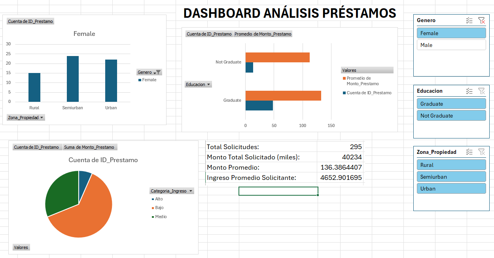

# 📊 Análisis Financiero en Excel

## Descripción
Dashboard interactivo para análisis de Loan Prediction Problem

## Dataset
- Fuente: [[link](https://www.kaggle.com/datasets/altruistdelhite04/loan-prediction-problem-dataset?resource=download)]
- Registros: [367]

## Análisis Realizados
- ✅ Limpieza de datos con Power Query
- ✅ KPIs financieros
- ✅ Tablas dinámicas
- ✅ Dashboard interactivo

## Screenshots

## Habilidades Demostradas
- Excel avanzado
- Análisis de datos financieros
- Visualización de datos
- Power Query

## Contacto
[[LinkedIn](https://www.linkedin.com/in/martin-alonso-centeno-leon-220586342/)]